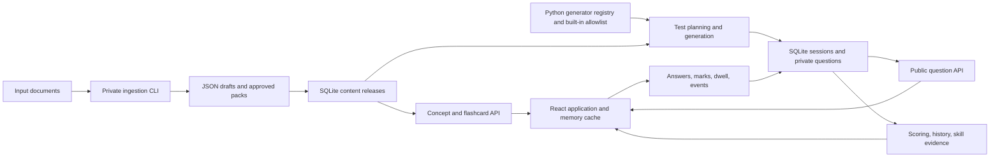

> Historical audit snapshot before baseline 1bc58c8 and batch 1. Current task status and fixes are recorded in [REMEDIATION_TODO.md](REMEDIATION_TODO.md) and [FIX_LOG.md](FIX_LOG.md).

# Grove architecture and scope audit

Reviewed: 30 September 2026. Target: `.`.

Grove has a sensible foundation for a small personal application: React, FastAPI, SQLite, a private ingestion CLI, server-generated questions, and stored history. The current implementation is substantially more functional than the original split-repository prototype. However, its central promise—use trustworthy test results and timing to identify weaknesses and send the learner back to appropriate material—is not yet reliable. Question correctness, timing, test lifecycle, and content coverage need repair before further feature expansion.

The move into one application directory is a reasonable simplification. The important boundaries are between public learning content, private assessment data, runtime learner records, and content publication. Several of those boundaries are only partially implemented.

## Review basis and limits

I read both pages of the referenced [Research aptitude app architecture chat](thread://01a0aab6-2190-7242-8a3a-9f789ddf5222?hostId=local), including the original request, the scope tightening, later UI corrections, and the handoff request. I compared those decisions with:

- [The original consolidated handoff](../.local/history/aptitude-import-2026-10-01/GROVE_HANDOFF.md).
- [The historical monorepo handoff addendum](../GROVE_HANDOFF.md#L1721).
- The original frontend/backend code, repository history, local roadmaps and ADRs.
- The current backend routes, schemas, test engine, persistence, evidence model, scheduler, generator families, ingestion pipeline, frontend pages, cache and telemetry.
- Aggregate metadata from the existing database through SQLite read-only connections, and the existing content catalog/packs.

Application source was not changed. Existing tests and backend reproductions used temporary runtime databases. The frontend was typechecked and built into a temporary directory. Browser interaction, a fresh-machine installation, and a threaded network stress test were not performed. Source findings are distinguished below from isolated reproductions and current-data observations.

The current `grove` directory has no `.git` directory and does not resolve as a Git repository. The old frontend and backend repositories retain their histories and have uncommitted changes. Consequently, the reconstruction of the consolidation relies on documentation and source rather than a complete migration commit history. I did not assume that additions made in another agent's conversation lacked user approval; that conversation was not supplied.

## How Grove started and changed

1. **Original idea:** a broader aptitude/reasoning application with scalable topic organization, randomized questions, timers, history, analysis, FOSS building blocks, assisted authoring, and eventual mobile synchronization.
2. **Explicit scope tightening:** a lightweight personal learning application with Learn, simple flashcards, isolated Tests, authoritative backend scoring, detailed client observations, and a private PowerPoint ingestion pipeline. Accounts, formal aptitude measurement, runtime LLM generation, mobile, sync, and a full CMS were deferred.
3. **17 September:** the initial frontend and backend repositories were initialized.
4. **17–18 September:** the original application repositories gained a React UI prototype and a FastAPI health scaffold. The old frontend still contains static concept data; the old backend remains principally a health service. This was a prototype, not the completed test architecture.
5. **19 September handoff:** the planning chat's later decisions were consolidated. History was deliberately simplified to recent tests, learning, and flashcards; richer analysis was deferred. The user explicitly rejected a correctness-only definition of a strong skill.
6. **Current implementation:** the current handoff's §27 records the monorepo arrangement, private backend CLI, SQLite, and built-in deterministic families. The changelog records further work through application version 0.3.8, including content ingestion, detailed test review, spaced repetition, caching, and module registries.

The application's purpose remains: **learn a concept → test it → get a trustworthy result → understand the weak skill → return to the relevant explanation/review**. The current code implements the screens and much of the plumbing, but the evidence connecting those screens has gaps.

## Current architecture

Content releases and learner/runtime tables share **one physical SQLite file**, currently `grove/data/grove.db`. Media lives under `grove/content/media`. This differs from older documentation describing two database files or `backend/data`.

| Part | Actual responsibility | Assessment |
|---|---|---|
| React/Vite frontend | Learning pages, flashcard sessions, setup, test runner, results and history | Suitable stack; several state/recovery defects |
| FastAPI routers and Pydantic models | HTTP contracts and explicit response shapes | Clear separation; alternate endpoints bypass some test assumptions |
| Test engine | Seeded planning, materialized questions, tickets, scoring | Good starting structure; lifecycle/transaction defects |
| SQLite persistence | Releases, sessions, answers, scores, timing, activity, scheduling | Appropriate for one learner; migrations and some integrity enforcement missing |
| Evidence and history | Skill statuses and personal timing comparisons | Incomplete implementation of the agreed multi-signal model |
| Generator registry | 34 registered families | 33 actually eligible for tests; semantic validation insufficient |
| Ingestion CLI | Discover/extract/classify/organize/pack/import | Useful local pipeline; approval and portability need strengthening |
| Content sources | Corpus, code-authored cards, bootstrap content, JSON packs, DB release | Multiple sources of truth remain |

The component split is generally worth keeping. Small facade modules preserve imports while routers, engine, persistence, generators, and ingestion have separate responsibilities. There is no present need for microservices, Redis, a worker fleet, or Postgres.

## Observed content and coverage

These are the local snapshot's values, not counts copied from the README:

| Measure | Observed |
|---|---:|
| Active buckets | 2 |
| Declared skills | 44 |
| Registered generator families | 34 |
| Families eligible for tests | 33 |
| Skills covered by eligible families | 28 |
| Current stored content release | `grove-ingested` 0.3.5 |
| Concepts | 27 |
| Flashcards | 97 |
| Imported question-pool records | 720 |
| Pool records carrying a speaker-note answer | 447 |
| Tested skills without a matching current concept | 9 |
| Concept skills with no eligible test family | 8 |
| Concepts retaining a draft-summary instruction | 9 |
| Concepts with no worked examples | 9 |
| Concepts with no common-mistake entries | 27 |
| Concepts with no related-family entries | 27 |

The catalog reports 906 decks, 294 unique files, 84 active and 210 deferred. These counts differ from the older README's 1024/412/103 figures. No media IDs declared by the current pack were missing locally. Three existing sessions were still marked active despite deadlines in the past; only aggregate learner metadata was inspected.

## Comparison with the intended scope

| Agreed requirement | Current implementation | Status |
|---|---|---|
| Small, personal, two-bucket app | Localhost-bound server; shared deployment learner | Preserved |
| React/Bun and FastAPI/uv | Implemented with lockfiles | Preserved |
| One application repo if it simplifies work | Recorded in current handoff §27 | Deliberate consolidation |
| No answer bank in frontend source | Questions generated/server-held; frontend types omit live answer keys | Preserved on the normal question endpoint |
| Only the requested test question exposed | Normal question route is minimal; active history detail returns the full test | Broken across the API surface |
| Flush learning state and isolate tests | Chrome disappears; learning cache survives and content endpoints stay available | Partial |
| Server owns expiry and score | Implemented, with terminal-state and transaction defects | Partial |
| Accurate per-question active time | Dwell tracking exists, but double counting and hidden-time errors reproduce | Broken |
| Multi-signal skill evidence | Accuracy/limited consistency/timing; several agreed signals unused | Partial |
| Learn links from weak skills | Links constructed from IDs; nine tested skills lack concepts | Partial |
| Simple recent-activity History | Three activity lists remain | Preserved; separate detailed review added |
| Simplified Again/Remember flashcards | Again/Good/Easy, scheduling, topic decks and review queues | Expanded beyond referenced planning slice |
| Count-derived test duration | Default preserved; custom duration added | Expanded |
| Private PowerPoint ingestion | CLI, source hashes and slide references exist | Implemented with publication gaps |
| Assisted LLM authoring, draft-only | No LLM enrichment/provider workflow | Planned capability absent |
| Immutable approved releases | Unique release/version DB rows; weak validation/manifests and live-code merge | Partial |
| Admin destination without public upload | Read-only status page; no public import/upload operation | Preserved initial boundary |
| Accounts/mobile/sync/calibration later | No implementation | Correctly deferred |

Spaced repetition, detailed review, source-file opening, custom durations, and broader taxonomy entries may be useful additions. They should be reconciled with the staged handoff and roadmap. Their existence is not evidence that the original first-release requirements are complete.

## Findings to address first

### 1. High — some accepted answers are mathematically wrong or non-unique

Isolated generator checks produced:

- `What is 12% of 160?` with accepted answer **19**; the exact answer is **19.2**, absent from the options.
- Simple interest on ₹15877 at 10% for two years with accepted answer **3175**; the exact answer is **3175.4**, with no rounding instruction.
- An ordering question fixes Amit first, Chetan second, Esha last, then asks who **cannot** be second. Esha, Amit and Bina are all offered and all satisfy the question, but only Esha is scored correct.

The circular seating generator also selects the previous clockwise neighbor as the left neighbor for inward-facing people; the left neighbor is the next clockwise person. Its shuffled listing is described as starting from P without ensuring P is first. This last observation is a source/geometry review rather than a browser reproduction.

Distinct option strings and a seeded RNG do not establish one semantically correct answer. These errors directly corrupt both the score and the learner model.

**Repair:** quarantine affected families; use exact arithmetic or explicit rounding instructions; check logic solutions against all legal arrangements; retain independent answer-oracle and ambiguity regressions. Sources: [percentages](../backend/app/content_engine/families/frp.py#L12), [interest](../backend/app/content_engine/families/averages.py#L73), [arrangements](../backend/app/content_engine/families/arrangements.py#L12).

### 2. High — timing measurements are inflated and include hidden time

Executing the existing `DwellTracker` with a controlled clock showed:

- Leaving question 0 after two seconds returns a two-second POST segment. The next `drain()` returns those same two seconds again because `leave()` did not consume the accumulator.
- After a pause for a hidden tab, `drain()` clears the paused state. The following drain reports five seconds of **active** time while the tab is still hidden.

Visibility handling also posts a snapshot without consuming it. This is a measurement bug in ordinary usage, independent of whether client observations can be manipulated.

**Repair:** separate total observed time from unsent segments; consume each segment once; preserve visibility/focus pause state across drains; give segments IDs so retries cannot add duplicates. Source: [DwellTracker](../frontend/src/runner/TestRunner.tsx#L66).

### 3. High — expired sessions remain mutable

Reproduction: backdate a deadline, submit an answer, receive **410 expired**, then retry with another option and receive **200**. The session stays expired, its answer changes to `d`, and its frozen score still records `b`. Question retrieval and marking also return 200 for that terminal session.

`_ensure_active()` returns successfully for submitted/expired states. Answer submission rejects submitted separately, but not expired; other callers also rely on the permissive helper.

**Repair:** active-only operations must reject every terminal state; result reads need a separate guard. Ensure repeated expired requests return the same frozen result without writes. Source: [runtime lifecycle guard](../backend/app/engine/runtime.py#L13).

### 4. High — answer saving and score finalization are not one consistent transaction

Answer submission checks state, writes the answer, and writes correctness in separate transactions. Scoring reads before `finalize_session()` acquires its write transaction. A deterministic interleaving of those existing operations finalized the test with five unanswered questions and then successfully wrote an answer into the submitted session.

The database helper does atomically store a final state plus a score, but the score supplied to it may already be stale. This reproduction demonstrates the permitted interleaving; it was not a threaded load test.

**Repair:** serialize the active/deadline/ticket check and answer/correctness write; compute and freeze final score within the same protected transaction. A process-local Python lock around individual writes does not cover the whole lifecycle. Sources: [answer writes](../backend/app/engine/runtime.py#L168), [score computation](../backend/app/engine/scoring.py#L68), [finalization](../backend/app/db/sessions.py#L102).

### 5. High — the frontend can show answers that were never saved

`choose()` updates displayed answer state before saving and silently catches most failures. It checks error code `stale ticket`, while the API supplies `stale_ticket`, so that recovery branch does not run. Submission waits for dwell/events, not pending answer requests. Answer buttons remain usable while submitting. A failed finish leaves `submittedRef` true, preventing a retry in that runner instance.

**Repair:** distinguish pending/saved/failed answer state, serialize revisions, retry safely, wait for pending answers before finalization, disable answer changes while submitting, and restore a retryable phase on finish failure. This finding is from source inspection. Source: [answer selection](../frontend/src/runner/TestRunner.tsx#L368), [submission](../frontend/src/runner/TestRunner.tsx#L282).

### 6. High — an alternate endpoint exposes the whole active test

`GET /api/history/tests/{id}` returned **all five questions** while the test was active, including future prompts/options, family IDs, skills and difficulty. Correct-option values and explanations were withheld, so this is **not** a demonstrated direct answer-key leak. It nevertheless defeats the planned minimum-question exposure policy.

**Repair:** reserve detailed question history for finalized tests. Active history should return a session summary, not the test's question list. Source: [test detail](../backend/app/history.py#L36), [route](../backend/app/routers/misc.py#L41).

### 7. High — test-mode learning isolation is visual only

The module-level cache retains prefetched concepts, worked-example answers, flashcards, media and prior review data. The runner also retains all previously fetched test questions in its `questions` map. There is no entry-time cache flush or shared active-test guard. The Learn and Flashcards APIs returned 200 during an active test.

**Repair:** make an explicit test-mode transition that clears unnecessary learning state and prevents in-flight learning reads from repopulating it. Apply the agreed active-test policy to learning API access. Keep the normal question route allowlisted. Sources: [memory cache](../frontend/src/api/cache.ts#L11), [test entry](../frontend/src/runner/TestRunner.tsx#L249), [learning routes](../backend/app/routers/content.py#L43).

### 8. High — evidence does not implement the agreed learner model

Skill pace is compared with the median of correct answers **across all skills**, rather than comparable skill/family/difficulty attempts. Test-detail medians group by skill/family but omit difficulty and include the current test, with no minimum evidence threshold.

Further gaps:

- The supposed recent-consistency input is read without chronological ordering.
- Difficulty handled and improvement/deterioration are not used.
- Mark rate is exposed but does not influence status.
- `answer_changed` is never updated in the timing table; revisit counts track API fetches, while normal frontend revisits use cached questions.
- `needs_review` is declared but never returned by the status function.
- The status function can return **strong** with five attempts and no timing evidence.
- Unseen taxonomy skills are not emitted, so the model cannot describe complete coverage.

**Repair:** define evidence rules explicitly and derive them from chronologically ordered, immutable attempts and events. Group timing by comparable task/difficulty, separate prior baseline from current performance, and explain unavailable signals. Sources: [skill evidence](../backend/app/evidence.py#L114), [status rules](../backend/app/evidence.py#L51), [history baselines](../backend/app/history.py#L122).

## Content and architecture gaps

### 9. Medium — tested skills and teaching content do not join reliably

Nine tested skills have no concept in release 0.3.5: ordering, seating, coding-decoding, symbol substitution, number series, letter series, fractions, percent change, and divisibility. Links are constructed as `concept.{skill_id}` rather than resolved against the release, so these recommendations lead to absent content.

Eight concept skills cannot be tested: data arrangements, pattern completion, analogies, data interpretation, clocks, calendars, crypt arithmetic, and relative speed. Sixteen of 44 declared skills have no eligible family at all. All current concepts omit common mistakes and related-family links; nine still instruct the reader to refine a draft summary.

**Repair:** publish a coverage matrix and a release-time referential-integrity check. Show explicit availability states, resolve real concept IDs, and complete a coherent set of learnable/testable/reviewable skills before broadening the taxonomy. Sources: [constructed evidence links](../backend/app/evidence.py#L172), [concept assembly](../backend/ingestion/organize/concepts.py#L156).

### 10. Medium — the ingested question bank is not the test bank

The 720 ingested questions are retained for review/future import; the test engine generates from the 33 built-in eligible families. Of those 720, 447 have a speaker-note answer, which establishes provenance but does not independently prove correctness. All current tests are text multiple-choice questions; diagrams and imported source questions are not integrated into assessment selection.

The planner alternates buckets and avoids repeated families where possible, which is useful. However, `used_skills` is recorded but not used to enforce distinct-skill coverage. There is no topic/skill-focused blueprint, exposure history, or guaranteed per-test difficulty quota. Focused retesting of a weak skill is therefore not available. Adaptive selection can remain deferred; a fixed focused blueprint would fit the small app.

**Repair:** decide explicitly whether the assessed bank is approved static items, validated families, or both; connect approved items through one assessment contract and publish blueprint capabilities from the server. Sources: [question pool](../backend/ingestion/pipeline.py#L222), [planner](../backend/app/engine/planning.py#L20).

### 11. Medium — approval is a flag, not a validated publication workflow

An isolated call produced an approved pack even with `report.ok == False`. `run_pack()` validates but does not stop when validation fails. Import checks an `approved` boolean and stores JSON; there is no strict pack model, integrity digest, per-item approval record, or recorded reviewer decision. It is not necessary to build a CMS to fix this.

The pack command overwrites the JSON file for a repeated version. The DB prevents replacing a release/version row, but duplicate import does not distinguish identical content from conflicting content under the same version. Media import does not install the referenced files from the work directory; current media happens to be present, but the documented import is not a complete portable release installation.

**Repair:** fail publication on validation errors, validate a strict pack schema, record review decisions, hash pack and media contents, reject version conflicts, and install referenced media as part of import. Sources: [packing](../backend/ingestion/pipeline.py#L275), [import](../backend/ingestion/cli.py#L43), [DB release storage](../backend/app/db/releases.py#L15).

### 12. Medium — source identity and source opening are fragile

Deck IDs are derived from filename stems, while the media index is keyed by that ID. The actual catalog has 38 repeated IDs; two IDs represent more than one distinct content hash, including an active ratio/proportion source. Their media/provenance can collide even though file-hash deduplication is separate.

The pipeline records relative `source_path` values. The frontend sends those values to `/api/source/open`, where `abspath()` resolves them against the backend's working directory rather than the pack's source root. With the documented `cd backend` launch, normal relative paths fall outside that root and are rejected. No file-manager action was executed for this review.

**Repair:** use a stable source ID incorporating content hash/relative path, and have source opening accept a known source ID resolved server-side under the configured corpus root. Sources: [deck identity](../backend/ingestion/pipeline.py#L99), [source resolution](../backend/app/routers/content.py#L72), [frontend source paths](../frontend/src/pages/Concept.tsx#L211).

### 13. Medium — release immutability does not include generator/taxonomy behavior

`load_release()` replaces every pack's family list with today's bootstrap allowlist. The family registry contains 34 families, while that list contains 33; `arith.series_sum` is registered but cannot enter tests. Registering a plugin or publishing a pack with a family list is therefore insufficient to activate it.

History/evidence also join through the current family map instead of using only the stored question's skill and release definitions. Changing code mappings can change historical evidence interpretation. Full question snapshots protect old prompts/options/keys, which is a positive foundation, but there is no generator revision or taxonomy version in the effective content contract.

The extractor registry similarly has useful separation, but discovery still uses fixed PPTX/PDF/DOCX glob patterns; registering another suffix alone does not make it discoverable.

**Repair:** keep executable generator code separate from approved release metadata, pin generator/taxonomy revisions, honor validated allowlists, and aggregate history from frozen question metadata. Sources: [release merge](../backend/app/content_engine/releases.py#L35), [registry](../backend/app/content_engine/families/registry.py#L38), [discovery](../backend/ingestion/pipeline.py#L64).

### 14. Medium — database integrity and operations are unfinished

Normal database connections return `PRAGMA foreign_keys = 0`. The pragma is enabled only on the initialization connection, so declared references are not enforced on subsequent connections. Schema evolution uses `CREATE TABLE IF NOT EXISTS`, without a migration history. Three current sessions remain active past deadline because expiry is lazy and history reads do not reconcile them. There is no resume/cancel workflow in the runner: mounting it creates a new session, and React development StrictMode can issue duplicate creates.

Content and runtime sharing one SQLite file is reasonable here. It still needs a clear backup/restore procedure including media, a schema version, connection-level pragmas, stale-session reconciliation, and minimal recovery semantics. Future synchronization would need durable event IDs/ordering/idempotency; it is correctly deferred today.

Sources: [connections](../backend/app/db/connection.py#L25), [schema](../backend/app/db/schema.py), [session creation effect](../frontend/src/runner/TestRunner.tsx#L250).

### 15. Medium — read caching can prevent recovery or show the wrong route's data

An isolated execution of the cache showed: first request fails, backend becomes available, second request still rejects, and total network calls remain **one**. The first rejected promise is never evicted. `useApiData()` also depends only on the cache's global version, not the data key; changing a route parameter while the page stays mounted can leave the previous test detail in place.

Flashcard grades invalidate deck reads but not History, so recent flashcard activity can remain stale until refresh. Concept views likewise do not invalidate learning history. Invalidation is deliberately narrow, but it does not match all data relationships.

**Repair:** evict failed inflight entries, key the hook by resource identity, prevent stale responses from winning, and invalidate the relevant activity summaries. Sources: [initial cached fetch](../frontend/src/api/cache.ts#L49), [hook dependencies](../frontend/src/api/hooks.ts#L40).

### 16. Medium — replay/idempotency and telemetry are incomplete contracts

Submitting `a`, then `b`, with the same ticket **and the same idempotency key** succeeds twice and stores `b`. Tickets rotate on retrieval, not on answer acceptance, and the idempotency parameter is unused. Answer changes are a required feature, but replaying one operation should not silently become a different operation.

Event types are free-form strings; event batches have no stable IDs, deduplication, session-phase validation or deterministic sequence. Client buffering drops failed batches. Dwell POST failures are swallowed, and there is no reliable unload delivery. The configured per-event byte knob is unused; the request-size middleware checks Content-Length rather than bounding the actual received stream.

**Repair:** define answer revision and replay semantics, use operation/segment IDs, bound and validate event contracts, and expose missing analytics as missing rather than zero. Sources: [answer contract](../backend/app/engine/runtime.py#L168), [event route](../backend/app/routers/tests.py#L87), [telemetry buffer](../frontend/src/api/telemetry.ts#L35), [body cap](../backend/app/security.py#L84).

### 17. Lower priority — the dashboard and small-screen behavior drifted

The Overview streak is hardcoded to `0 days`; focused time was replaced by test count. The count is derived from a capped recent-history list while its tooltip says tests finalized so far. Accuracy averages recent test percentages without weighting question count. Unseen and low-evidence skills can result in a reassuring no-weak-areas message.

Several screens reintroduce explanatory backend/handoff language, metric tiles and ordinary-copy monospace treatment that the planning chat asked to remove. The sidebar is a fixed 224-pixel column without a mobile collapse, and the 20-button test navigator does not wrap. That is a source-level small-screen concern, not a screenshot-verified failure.

**Repair:** use real compact indicators, precise metric definitions, availability-aware empty states and a responsive navigation layout. Sources: [Overview](../frontend/src/pages/Overview.tsx#L31), [layout](../frontend/src/layout.tsx#L56), [navigator](../frontend/src/runner/TestRunner.tsx#L556).

### 18. Lower priority — project documentation and delivery tracking need consolidation

Changelog version is 0.3.8; package, backend project and API health versions remain 0.1.0. There is no current VERSION.txt. The copied handoff still labels substantial implemented stages as next/planned. Old ADRs/runbooks/roadmaps remain in the split repositories and were not carried into an equivalent current decision structure.

README ports/counts differ from actual configuration, and the architecture guide's ingestion commands use options not accepted by the CLI (`--workdir` and positional import instead of `--work`/`--pack`). The Python project enforces `<3.13`, stronger than the original soft-version-pin preference. No current CI configuration, frontend behavioral suite, or migration/backup runbook was found in the reviewed project.

**Repair:** initialize/version the current repository when implementation work resumes, reconcile canonical scope with accepted additions, choose one release-version source, update the roadmap and working commands, and automate the existing checks plus the new behavioral regressions. Sources: [README](../README.md), [architecture guide](ARCHITECTURE.md), [project metadata](../backend/pyproject.toml).

## What should remain deferred

Lack of user accounts, social features, mobile sync, Postgres, adaptive testing, IRT/CAT, percentile claims and a full Admin CMS is consistent with the tightened scope. Those are not reasons to declare the app incomplete.

The existing server binds to loopback and identifies every caller as `local-learner`, which fits the current personal/local model. That identity does not authenticate a protected network deployment. If hosting is later approved, an explicit access boundary and operator authorization are needed; CORS, UUID session IDs and API headers do not provide those. The browser document's security headers would also need to be supplied by its actual host, rather than only the API middleware.

Real PDF/DOCX extraction, OCR and LLM draft enrichment are absent: the first two have placeholder adapters. PowerPoint parsing is useful now, but compressed-file size alone is not a full expansion/resource limit. These should be described accurately and added when the actual corpus requires them.

## Recommended next work

Keep the current monorepo/module structure and restore a trustworthy narrow loop in this order:

1. **Correct assessment results:** quarantine/fix invalid questions; make answer writes and finalization transactional; reject mutations after expiry/submission; make frontend answer-save state and finish retries reliable.
2. **Correct observations and isolation:** repair dwell accounting, preserve pause state, implement idempotent segments, freeze detailed history until finalization, and flush/guard learning state at test entry.
3. **Complete one coherent content slice:** map each available test skill to a real concept and flashcards; publish explicit learn/test coverage; enforce approved-pack schema, validation, hashes and media installation.
4. **Implement the agreed evidence rules:** compare prior comparable attempts, order recent evidence, use difficulty/change/review/trend signals, and show insufficient evidence honestly. Add fixed weak-skill retesting before considering adaptation.
5. **Make the app maintainable:** migrations/connection integrity, backup/restore, session recovery, cache recovery, accurate metrics, current roadmap/versioning, and CI.

The exit condition should be concrete: a learner can complete a test with correct, unique questions; every displayed answer is durably saved; the frozen result cannot change; timing is counted once and excludes hidden/unfocused intervals; and every weak-skill recommendation links to approved, relevant material.

## Verification and reproducible evidence

- Existing backend suite: **39 passed**. The sandbox-only run initially blocked two PPTX tests from loading the installed lxml DLL; rerunning with normal DLL access passed all tests. No application-code failures remained in that suite.
- Frontend strict TypeScript check: **passed**, with no emitted project files.
- Vite production build: **passed**, output under a temporary directory; main JS bundle approximately 342 kB / 111 kB gzip.
- Additional isolated checks reproduced the lifecycle, concurrent-interleaving, question-quality, approval, timing and cache failures described above.
- Current database survey used read-only connections and only aggregate metadata. Existing source, content and learner records were not edited.

Artifacts:

- [Backend reproduction script](../.local/audit/audit_probe.py).
- [Frontend reproduction script](../.local/audit/frontend_probe.cjs).
- [Read-only content survey](../.local/audit/content_survey.py).
- [Backend observations](../.local/audit/backend-observations.jsonl).
- [Frontend observations](../.local/audit/frontend-observations.jsonl).
- [Content observations](../.local/audit/content-observations.jsonl).

The existing test suite is a useful baseline, but it does not cover these failure paths. Passing builds establish that the application compiles and its tested paths run; they do not establish that its diagnoses are trustworthy.
